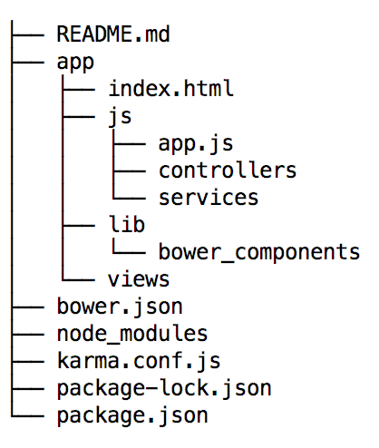

# Day 2

## Description

Today we will be introducing the front-end technologies for the app. We will go through an overview of the
dependency managers, the set-up for a typical web-app and finally we will create a coding example in the context of a messaging app.
By the end of this module, you should be a little bit more familiar with the Opal
application set up, the common AngularJS flow, OnsenUI flow, and ultimately how to
 set-up a project using these technologies. We will set-up testing, but we will
 not take care of that until later (once I have a chance to catch up! ;p).

## Homework
Readings:
- HTML introduction: https://www.w3schools.com/html/default.asp
Please read all of this guide. Its important to understand the basic
tags as Angular builds on top of this to create their own tags which will
have enhance functionality.
- JS introduction: https://www.w3schools.com/js/default.asp
This will be a great introduction to how JavaScript interacts with the
DOM natively. Every year the [ECMAScript](https://en.wikipedia.org/wiki/ECMAScript)
organization gets together and decides on how the JavaScript standard for the web
is going to evolve, this will include neat new features, or simply fixes
to previous API. Their main job is to provide an API that JavaScript uses inside a browser
to interact with the DOM tree, and to do other important functions such as a
a request to a server via a [get request](https://www.w3schools.com/tags/ref_httpmethods.asp).
Angular builds on top of this basic JavaScript API in two ways, first
it creates more  complex functionality and second it wraps this functions and offers
them to the user under the Angular paradigm.
- Git tutorial by Logan Montgomery: [git tutorial](https://docs.google.com/document/d/16PSag95XtbPKWGNi2K5PCtYNoGMo-haOJV3nsPXc2Z0/edit?usp=sharing),
please go through this tutorial, it will covers ome of the basic of Git.

## Resources
This might be a lot to process, to aid this process, the following resources
will help you plus the resources I will be adding along with the tutorial.
- [Code Academy](https://www.codecademy.com/) - Intro. Tutorials on JS, HTML, CSS, AngularJS
- [AngularJS Documentation](https://docs.angularjs.org/api)
- [OnsenUI Documentation] (https://onsen.io/v1/guide.html)
- [Styling guide AngularJS](https://github.com/johnpapa/angular-styleguide/blob/master/a1/README.md) Please
    use this style guide when writing your AngularJS code. It makes the code clean,
    consistent, and easy to use for people that follow.
- [HTML W3School](https://www.w3schools.com/html/default.asp)
- [AngularJS W3Schools](https://www.w3schools.com/angular/default.asp)

## Hello World the Opal Way

After this mini-tutorial you should have an idea of what the config files
do in our Angular application, how you'd go about creating each of them and
lastly your first web app, i.e. Hello World the opal front-end way :)


### Instructions

1. Install bower, npm, and gulp globally.
2. Run `$ npm init`, this will initialize your project development dependencies, creating a config file named package.json
it will ask common questions for a project set up such as the description, the version, and the name of the project.
3. Add bower as a development dependency `$ npm install bower --save-dev`
This will be the front-end dependency manager, this will handle and all our front-end dependencies
4. Run `$ bower init`, similarly as above, this will initialize your configuraton file
    for front-end dependencies creating a bower.json file.
5. Create a .bowerrc file to configure bower and add the contents as follows:
    ```
    {
        "directory":"app/lib/bower_components"
    }
    ```

This will install the added bower dependencies in the path pointed by "directory",
normally your application code lives in the app folder. The lib folder is the
place where you place all your application external libraries and dependencies.


6. Now its time to add and install our two major frameworks and front-end dependencies.
  ```
    bower install onsenui#1.3.16 --save
    bower install angular#1.4.14 --save
  ```


- The `--save` flag saves both of those dependencies in the bower.json file as actual project dependencies
OnsenUI and AngularJS are the two JavaScript dependencies we use in the app.
- AngularJS, provides a framework for thinking about the logic of a web-app building
on top of the __MVC__ design pattern. Here is a small introduction: https://docs.angularjs.org/guide/concepts
- OnsenUI is a CSS/JavaScript that provides out of the box components that are mobile
    looking, it allows a web-app to look and feel like a mobile app.
    Look through the start page on OnsenUI https://onsen.io/v1/guide.html,
    note that we will be working with version 1 of this framework. When you are going
    through the documentation make sure of that.


7. Start our index.html file with both of our dependencies.
```
<!DOCTYPE html>
<html lang="en">
<head>
    <meta http-equiv="content-type" content="text/html; charset=utf-8" />
    <title>Title</title>
    <link rel="stylesheet" href="lib/bower_components/OnsenUI/css/onsen-css-components.css">
    <link rel="stylesheet" href="lib/bower_components/OnsenUI/css/onsenui.css">
    <script src="lib/bower_components/angular/angular.min.js" type="application/javascript"></script>
    <script src="lib/bower_components/OnsenUI/js/onsenui.min.js" type="application/javascript"></script>
</head>
<body >


</body>

</html>

```
- Here we are adding 4 files. Two stylesheets, which will be the Onsen CSS components,
  and 2 JavaScript files, which will load the AngularJS framework and OnsenUI.
- See [OnsenUI Getting Started](https://onsen.io/v1/guide.html) if you have any problems.
  Your index.html page is the only page that will be loaded in your application,
  Angular will take care of dynamically swapping dependencies in and out within that page.
  It will also do other things like controlling the url, as to give the illusion of a
  multi-page app, and controlling your state via their Angular directives which
  always start with an `ng`.

8. Run server and test no errors, make sure to open in Chrome.
```
    http-server ./app -p 9000
```
To test for errors check the console by inspecting the page and choosing `console` on the
top bar of the browser. Let's also disable the cache on the site
by going into the `network` tab of the debugging tools and
[selecting](https://www.technipages.com/google-chrome-how-to-completely-disable-cache)
the `disable cache` box.

9. Now its time to start building the app. Angular app is bootstrapped by the
module config function. To do this, we do two different things.
First, we create a tag on the `index.html` as to tell Angular
where to start nesting the application.
```
<!DOCTYPE html>
<html lang="en">
<head>
    <meta http-equiv="content-type" content="text/html; charset=utf-8" />
    <title>Title</title>
    <link rel="stylesheet" href="lib/bower_components/OnsenUI/css/onsen-css-components.css">
    <link rel="stylesheet" href="lib/bower_components/OnsenUI/css/onsenui.css">
    <script src="lib/bower_components/angular/angular.min.js" type="application/javascript"></script>
    <script src="lib/bower_components/OnsenUI/js/onsenui.min.js" type="application/javascript"></script>
</head>
<body ng-app="messaging-app">


</body>

</html>
```
Here we have told Angular to start our application from the body tag of our html tree.
Secondly, we instantiate the module, i.e.
```
angular.module("<name-module>",[<list-of-angular-dependencies>])
```
This will create an Angular module with the name given and declare
the set of Angular dependencies for the module.

10. Instantiating an angular module.
- Create 'app.js' file under the `app/js` directory and include

```
(function(){
    var module = angular.module("<name-module>",["onsen"]);


})();
```
This creates and defines the angular module and the angular dependencies,
 using the same name you used in the ng-app tag template, i.e. `messaging-app` (replace `"<name-module>"` with `"messaging-app"`).
  In terms of dependencies, `onsen` will be our only dependency.
   Notice the `(function(){})();`, this will encapsulate
our code as to not let variables escape from scope, if you
try to simply declare variables in a JavaScript file without function
encapsulating. You will risk having collision
problems between your variables of different files in the workspace.

- Now, link to app.js from index.html by adding the following line between the head tags in `index.html`.
```
   <script src="js/app.js" type="text/javascript"></script>
```

We are now ready to add logic to your app. We will create an onsen navigator,
an onsen page, and finally our logic for the hello world app.

11. To the index.html file, add the following between the <body> tags

```
    <ons-navigator var="navi" page="./views/hello-world.html"></ons-navigator>
```
This navigator instantiates the global variable `navi`, which will allow you to add and remove pages,
and in general manipulate the navigator. The url in the page attribute points to the root page for the
navigator. The navigator creates an stack of pages from which you will just push and pop.
See [page navigation](https://onsen.io/v1/guide.html#page-navigation) for more details on this.

12. Create a view called `hello-world.html` and place it under the views
directory. To this view, add the following ons-page.

```
<ons-page ng-controller="HelloWorldController as vm">
    <ons-toolbar>
      <div class="center">Simple Navigation</div>
    </ons-toolbar>
    <div style="text-align: center">
      <br>
      <!--TODO: Add the binding from the controller to print hello world on the page.-->
     <p></p>
    </div>
  </ons-page>
```
Notice the TODO task on the list, filled this app after the controller is done. This html create
and ons-page component which is the component pushed onto onsen navigators. The
ng-controller tag indicates the controller use for this view.

13. Create a controller called `helloWorldController.js` and place it under the js/controllers
directory.
Here are the contents for the controller.

```
(function(){
    var module = angular.module('<name-module>'); // Fetches the angular the module so that the controller can access it.

    module.controller("HelloWorldController",HelloWorldController); // Declares the component in the angular module


    HelloWorldController.$inject = []; // Injects the angular dependencies for this Controller


    function HelloWorldController(){ // function representing this controller, vm, is the equivalent of $scope
        var vm = this;
        // Create and attach hello_world variable to the vm object.

    }
})();
```

Again, replace `'<name-module>'` with `'messaging-app'`.

14. Add the controller to your index.html.

```
<!DOCTYPE html>
<html lang="en">
<head>
    <meta http-equiv="content-type" content="text/html; charset=utf-8" />
    <title>Title</title>
    <link rel="stylesheet" href="lib/bower_components/OnsenUI/css/onsen-css-components.css">
    <link rel="stylesheet" href="lib/bower_components/OnsenUI/css/onsenui.css">
    <script src="lib/bower_components/angular/angular.min.js" type="application/javascript"></script>
    <script src="lib/bower_components/OnsenUI/js/onsenui.min.js" type="application/javascript"></script>
</head>
<body ng-app="messaging-app">
    <ons-navigator var="navi" page="./views/hello-world.html"></ons-navigator>

    <!--Controllers-->
    <script src="js/controllers/helloWorldController.js" type="application/javascript"></script>

</body>

</html>

```

15. Add "Hello World" to the controller.

In `helloWorldController.js`, replace the line `// Create and attach hello_world variable to the vm object.` with the following:
```
    vm.hello = "Hello World!"
```

16. Link the controller variable 'hello' to the view.

In `hello-world.html`, replace the line `<!--TODO: Add the binding from the controller to print hello world on the page.-->` with the following:
```
    <h1>{{vm.hello}}</h1>
```
In the view, vm refers to the line at the top of the page `<ons-page ng-controller="HelloWorldController as vm">`, and `hello` is the variable defined in this controller. The curly brackets are used to express the contents of the variable instead of printing `vm.hello` in plain text to the screen.

17. Run the code and see if it works.
18. If the above fails, debug and figure out what's wrong :) Google is your friend and so am I.


Your folder should look like this at the end:




__Success__!!! You have now gone through the basic steps to get an AngularJS app
with our front-end technology stack! Now you are ready, to move on to your
first Angular Application.

If you have any problems, send me an e-mail to: davidfherrerar@gmail.com
